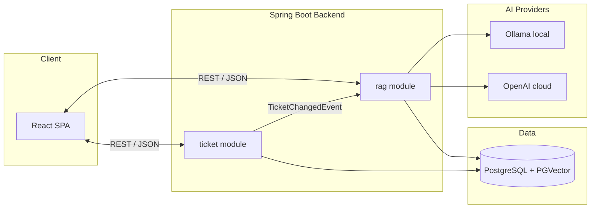

# AI-Powered Support Ticket Management

A full-stack support ticket system with server-enforced lifecycle rules, search and filtering, and a RAG-based knowledge assistant that answers questions strictly from indexed ticket history—with structured source citations.

## Overview

Support agents use the React UI (or REST API) to create tickets, collaborate via comments, and move tickets through a validated state machine. Ticket content is indexed asynchronously into a PGVector store; the assistant retrieves relevant history, applies a grounding guard, and returns answers backed by real ticket data.



## Tech Stack

| Layer | Technologies |
|-------|--------------|
| Backend | Java 21, Spring Boot 3.5, Spring AI 1.1, Spring Data JPA, Liquibase, MapStruct, Lombok |
| Frontend | React 19, TypeScript 5, Vite 6, React Router 7, Vitest |
| Database | PostgreSQL 16 with PGVector extension |
| AI (local) | Ollama — `nomic-embed-text` (embeddings), `llama3.2:3b` (chat) |
| AI (cloud) | OpenAI — optional `openai` Spring profile |
| API docs | springdoc-openapi (`/swagger-ui.html`) |

## Features

| Area | Description |
|------|-------------|
| **Tickets** | Create, list, detail view, field updates, comments (add-only) |
| **Lifecycle** | Server-enforced state machine: `OPEN` → `IN_PROGRESS` → `RESOLVED` → `CLOSED` (or `CANCELLED`) |
| **Search** | Keyword search on title/description plus status filter |
| **Assistant** | RAG Q&A with grounded answers and structured source citations |
| **Indexing** | Async re-index on searchable text changes; metadata-only updates skip re-embedding |

Invalid state transitions return HTTP 409. Missing resolution text when moving to `RESOLVED` returns HTTP 400. When retrieval finds no relevant tickets, the assistant returns a fixed no-match message with an empty `sources` array.

## Prerequisites

- **Java 21** and **Maven 3.9+**
- **Node.js 20+** and **npm**
- **Docker** (for local PostgreSQL with PGVector)
- **Ollama** for local development (embeddings + chat; no API key required)

Optional: OpenAI API key when using the `openai` profile.

## Quick Start

### 1. Environment

Copy `.env.example` to `.env` (or export variables in your shell):

```bash
cp .env.example .env
```

Key variables for local development:

```bash
export SPRING_PROFILES_ACTIVE=local
export DB_HOST=localhost
export DB_PORT=5432
export DB_NAME=ticketing
export DB_USER=ticketing
export DB_PASSWORD=ticketing
export OLLAMA_BASE_URL=http://localhost:11434
export EMBEDDING_DIMENSIONS=768
export APP_RAG_RETRIEVAL_TOP_K=5
export APP_RAG_RETRIEVAL_SIMILARITY_THRESHOLD=0.50
```

Install and start Ollama, then pull the required models:

```bash
# macOS
brew install ollama
brew services start ollama

ollama pull nomic-embed-text   # embeddings (768 dimensions)
ollama pull llama3.2:3b        # chat (~2 GB)
```

Verify Ollama is running:

```bash
curl -s http://localhost:11434/api/tags
```

### 2. Database

```bash
docker compose up -d
```

This starts PostgreSQL 16 with PGVector on port `5432` (user/password/database: `ticketing`).

### 3. Backend

```bash
cd backend
./mvnw spring-boot:run
```

Liquibase migrations apply on startup. Verify health:

```bash
curl -s http://localhost:8080/actuator/health
```

### 4. Frontend

```bash
cd frontend
npm install
npm run dev
```

Open [http://localhost:5173](http://localhost:5173).

## UI Routes

| Route | Page |
|-------|------|
| `/tickets` | Ticket list with search and status filter |
| `/tickets/new` | Create ticket form |
| `/tickets/:id` | Ticket detail, comments, status actions |
| `/assistant` | RAG Q&A with source citations |

## API Endpoints

Base URL: `http://localhost:8080`

### Tickets (`/api/v1/tickets`)

| Method | Path | Description |
|--------|------|-------------|
| `POST` | `/api/v1/tickets` | Create ticket |
| `GET` | `/api/v1/tickets` | List tickets (`?q=`, `?status=`) |
| `GET` | `/api/v1/tickets/{id}` | Get ticket detail |
| `PATCH` | `/api/v1/tickets/{id}` | Update title, description, priority, assignee |
| `PATCH` | `/api/v1/tickets/{id}/status` | Transition status (requires `resolution` for `RESOLVED`) |
| `POST` | `/api/v1/tickets/{id}/comments` | Add comment |

### Assistant (`/api/v1/assistant`)

| Method | Path | Description |
|--------|------|-------------|
| `POST` | `/api/v1/assistant/ask` | Ask a grounded question |
| `GET` | `/api/v1/assistant/index-status/{ticketId}` | Check indexing job status |

OpenAPI contracts: [`specs/001-support-ticket-rag/contracts/tickets-api.yaml`](specs/001-support-ticket-rag/contracts/tickets-api.yaml) and [`specs/001-support-ticket-rag/contracts/rag-api.yaml`](specs/001-support-ticket-rag/contracts/rag-api.yaml).

Interactive docs (backend running): [http://localhost:8080/swagger-ui.html](http://localhost:8080/swagger-ui.html)

## OpenAI Profile (Optional)

For cloud embeddings and chat instead of Ollama:

```bash
export SPRING_PROFILES_ACTIVE=openai
export OPENAI_API_KEY=sk-...
export EMBEDDING_DIMENSIONS=1536
export APP_RAG_RETRIEVAL_SIMILARITY_THRESHOLD=0.75
```

## Configuration Reference

| Variable | Default | Description |
|----------|---------|-------------|
| `SPRING_PROFILES_ACTIVE` | `local` | `local` (Ollama) or `openai` |
| `DB_HOST` | `localhost` | PostgreSQL host |
| `DB_PORT` | `5432` | PostgreSQL port |
| `DB_NAME` | `ticketing` | Database name |
| `DB_USER` | `ticketing` | Database user |
| `DB_PASSWORD` | `ticketing` | Database password |
| `OLLAMA_BASE_URL` | `http://localhost:11434` | Ollama API base URL |
| `EMBEDDING_DIMENSIONS` | `768` | Vector dimensions (`1536` for OpenAI) |
| `APP_RAG_RETRIEVAL_TOP_K` | `5` | Max chunks retrieved per query |
| `APP_RAG_RETRIEVAL_SIMILARITY_THRESHOLD` | `0.50` | Minimum cosine similarity for retrieval |
| `OPENAI_API_KEY` | — | Required when `SPRING_PROFILES_ACTIVE=openai` |

## Project Structure

```
ai-ticketing-system/
├── backend/                    # Spring Boot API
│   └── src/main/java/com/ticketing/
│       ├── ticket/             # CRUD, comments, search, state machine
│       ├── rag/                # Indexing, retrieval, grounding, assistant
│       └── shared/             # Config, exceptions, cross-cutting concerns
├── frontend/                   # Vite + React SPA
│   └── src/features/
│       ├── tickets/            # Ticket list, detail, create, comments
│       └── assistant/          # Q&A UI with source citations
├── specs/001-support-ticket-rag/
│   ├── spec.md                 # Feature specification
│   ├── plan.md                 # Architecture and design
│   ├── quickstart.md           # End-to-end validation scenarios
│   └── contracts/              # OpenAPI specs and state machine docs
├── docker-compose.yml          # PostgreSQL + PGVector
└── .env.example                # Environment variable template
```

### Module Boundaries

| Module | Responsibility |
|--------|----------------|
| `ticket` | CRUD, comments, search, state machine, indexing job enqueue |
| `rag` | Knowledge document build, embed, vector upsert, retrieval, grounding, answers |
| `shared` | Configuration, exception handling, shared utilities |

Cross-module communication uses `TicketChangedEvent`; the `rag` module does not mutate ticket state directly.

## Testing

**Backend** (unit tests):

```bash
cd backend
./mvnw test
```

**Frontend**:

```bash
cd frontend
npm test
```

For step-by-step validation scenarios (CRUD, state machine, RAG Q&A, frontend smoke), see [`specs/001-support-ticket-rag/quickstart.md`](specs/001-support-ticket-rag/quickstart.md).

## Architecture Notes

- **RAG pipeline**: ticket mutation → indexing job (outbox) → canonical knowledge documents → embeddings → PGVector → similarity retrieval → grounding guard → LLM → answer + sources
- **Grounding**: answers are generated only from retrieved ticket context; no-match queries return a fixed message
- **Indexing failures**: jobs retry with exponential backoff; ticket commits are never rolled back on indexing failure
- **Re-indexing**: searchable text changes trigger re-embedding; metadata-only changes update vector metadata without re-embedding

## Documentation

| Document | Purpose |
|----------|---------|
| [`specs/001-support-ticket-rag/spec.md`](specs/001-support-ticket-rag/spec.md) | Feature requirements and user stories |
| [`specs/001-support-ticket-rag/plan.md`](specs/001-support-ticket-rag/plan.md) | Implementation plan and architecture |
| [`specs/001-support-ticket-rag/quickstart.md`](specs/001-support-ticket-rag/quickstart.md) | Runnable validation scenarios |
| [`specs/001-support-ticket-rag/contracts/state-machine.md`](specs/001-support-ticket-rag/contracts/state-machine.md) | Ticket lifecycle rules |
