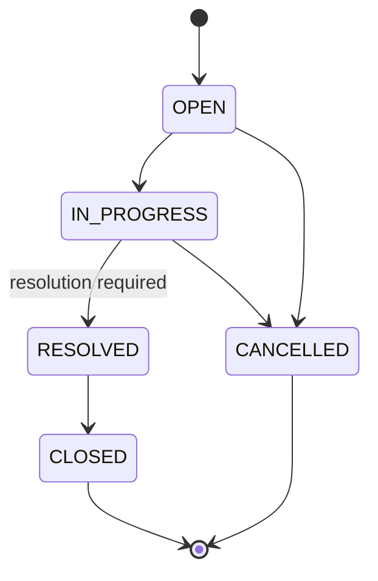

# Ticket State Machine

**Feature**: `001-support-ticket-rag` | **Date**: 2025-09-25

## States

| State | Terminal | Indexed metadata updated |
|-------|----------|--------------------------|
| `OPEN` | No | Yes (status field on knowledge documents) |
| `IN_PROGRESS` | No | Yes |
| `RESOLVED` | No | Yes; resolution document created/re-indexed |
| `CLOSED` | Yes | Yes |
| `CANCELLED` | Yes | Yes |

Terminal states (`CLOSED`, `CANCELLED`) reject all forward transitions.

## Transition Table

| From | To | Preconditions | Side Effects |
|------|----|---------------|--------------|
| `OPEN` | `IN_PROGRESS` | — | Update status metadata on knowledge docs |
| `OPEN` | `CANCELLED` | — | Update status metadata |
| `IN_PROGRESS` | `RESOLVED` | `resolution` non-blank | Create/update resolution knowledge doc; enqueue re-index |
| `IN_PROGRESS` | `CANCELLED` | — | Update status metadata |
| `RESOLVED` | `CLOSED` | — | Update status metadata |
| `*` (terminal) | `*` | — | **REJECT** with HTTP 409 |
| `OPEN` | `RESOLVED` | — | **REJECT** (skipped step) |
| `OPEN` | `CLOSED` | — | **REJECT** |
| `IN_PROGRESS` | `OPEN` | — | **REJECT** (no reopen) |
| `RESOLVED` | `OPEN` | — | **REJECT** |
| `RESOLVED` | `IN_PROGRESS` | — | **REJECT** |

## Implementation

`TicketStateMachine` (pure Java, no Spring) in `ticket.domain`:

```java
boolean canTransition(TicketStatus from, TicketStatus to);
TicketStatus transition(Ticket ticket, TicketStatus target, String resolution);
```

- `canTransition` — graph lookup only.
- `transition` — validates resolution when target is `RESOLVED`; throws `InvalidStateTransitionException` (mapped to 409).
- Service layer calls state machine; controller never sets status directly.

## Diagram



## Error Response

Invalid transition returns RFC 9457 problem:

```json
{
  "type": "https://api.example.com/problems/invalid-state-transition",
  "title": "Invalid State Transition",
  "status": 409,
  "detail": "Cannot transition from CLOSED to IN_PROGRESS",
  "instance": "/api/v1/tickets/550e8400-e29b-41d4-a716-446655440000/status"
}
```

Resolution missing on RESOLVED:

```json
{
  "type": "https://api.example.com/problems/resolution-required",
  "title": "Resolution Required",
  "status": 400,
  "detail": "Resolution notes are required when transitioning to RESOLVED"
}
```
